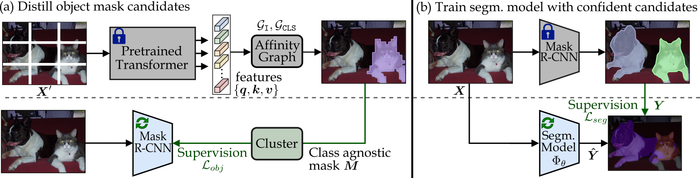
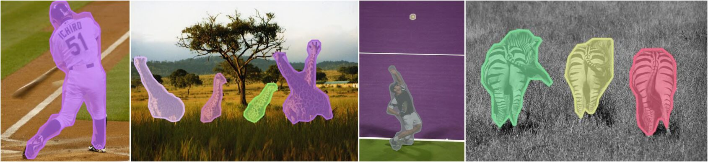
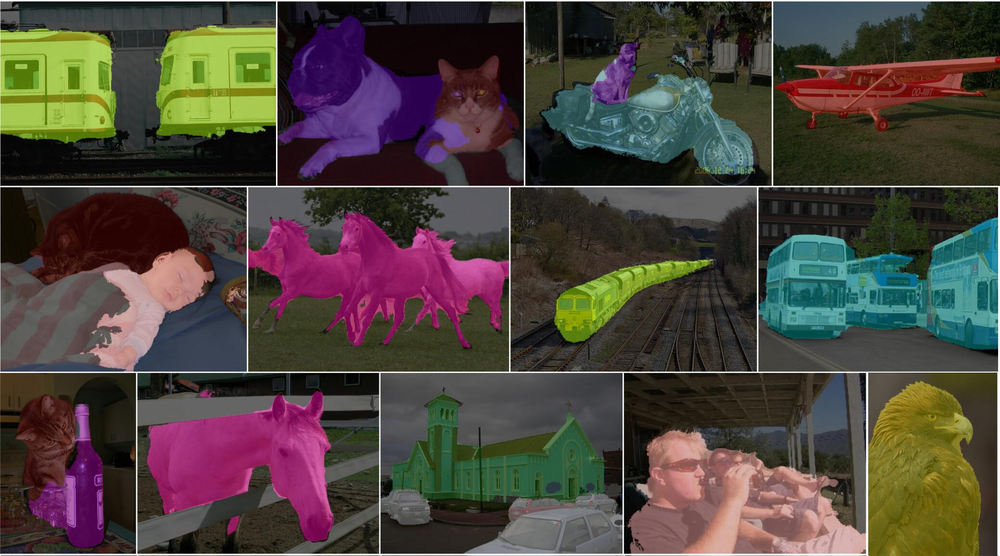

# Discovering Object Masks with Transformers for Unsupervised Semantic Segmentation

This repo contains the Pytorch implementation of our paper:
> [**Discovering Object Masks with Transformers for Unsupervised Semantic Segmentation**](https://arxiv.org/abs/2206.06363)
>
> [Wouter Van Gansbeke](https://twitter.com/WGansbeke), [Simon Vandenhende](https://twitter.com/svandenh1) and [Luc Van Gool](https://ee.ethz.ch/the-department/faculty/professors/person-detail.OTAyMzM=.TGlzdC80MTEsMTA1ODA0MjU5.html).

Check out [Papers With Code](https://paperswithcode.com/paper/discovering-object-masks-with-transformers) for the [Unsupervised Semantic Segmentation](https://paperswithcode.com/sota/unsupervised-semantic-segmentation-on-pascal-1?p=unsupervised-semantic-segmentation-by) benchmark and additional details.

[](https://paperswithcode.com/sota/unsupervised-semantic-segmentation-on-pascal-1?p=discovering-object-masks-with-transformers-1)

## Table of Contents
1. [Introduction](#-introduction)
0. [Installation](#-installation)
0. [Training MaskDistill](#-training-maskdistill)
    - [Setup](#setup)
    - [Overview](#overview)
    - [Mask Distillation](#part-1-mask-distillation)
    - [Semantic-Segmentation](#part-2-semantic-segmentation)
0. [Evaluation](#-evaluation)
    - [Linear Classifier](#linear-classifier)
    - [Clustering](#clustering)
    - [Semantic Instance Segmentation](#semantic-instance-segmentation)
0. [Limitations](#limitations)
0. [Citation](#-citation)
0. [Acknoledgements](#acknoledgements)

## 📋 Introduction  
The task of unsupervised semantic segmentation aims to cluster pixels into semantically meaningful groups. Specifically, pixels assigned to the same cluster should share high-level semantic properties like their object or part category. This paper presents MaskDistill: a novel framework for unsupervised semantic segmentation based on three key ideas. First, we advocate a data-driven strategy to generate object masks which serve as a pixel-grouping prior for semantic segmentation. This approach omits handcrafted priors, which are often designed for specific scene compositions and limit the applicability of competing frameworks. Second, MaskDistill clusters the object masks to obtain pseudo-ground-truth for training an initial object segmentation model. Third, we leverage this model to filter out low-quality object masks. This strategy mitigates the noise in our pixel-grouping prior, and results in a clean collection of masks which we use to train a final segmentation model. By combining these components, we can considerably outperform previous works for unsupervised semantic segmentation on PASCAL and COCO. Interestingly, as opposed to existing approaches, our framework does not latch onto low-level image cues and is not limited to object-centric datasets.

## 🛠 Installation
The Python code runs with Pytorch versions, e.g., v1.10. 
Assuming [Anaconda](https://docs.anaconda.com/anaconda/install/), the most important packages can be installed as:
```shell
conda install pytorch=1.10.0 torchvision=0.11.2 cudatoolkit=11.3 -c pytorch
conda install -c conda-forge opencv              # For transformations
conda install matplotlib scipy scikit-learn      # For evaluation
conda install pyyaml easydict                    # For using config files
conda install termcolor                          # For colored print statements
conda install pycocotools                        # For coco api
```
In addition to these packages, you'll need to install [detectron2](https://github.com/facebookresearch/detectron2) to train Mask R-CNN.
Finally, we use the transformer architectures from the [timm](https://github.com/rwightman/pytorch-image-models) library.

We refer to the `env/env_segmentation.txt` file for an overview of all the packages that we used to train DeepLab-v3. Similarly, `env/env_detectron2.txt` was used to train Mask R-CNN. 
The `segmentation/` code was run on 2 1080Ti GPUs while the `detectron2/` code was run on 4 Tesla V100 GPUs.

## ⚙ Training MaskDistill

### Setup
Clone this repository:
```shell
git clone https://github.com/wvangansbeke/MaskDistill.git
cd MaskDistill
```
We use the following datasets:
- PASCAL VOC object detection datasets: `VOC2007` and `VOC2012` can be downloaded from the official [website](http://host.robots.ox.ac.uk/pascal/VOC/).
- PASCAL VOC semantic segmentation [dataset](https://drive.google.com/file/d/1pxhY5vsLwXuz6UHZVUKhtb7EJdCg2kuH/view?usp=sharing): it contains the dense segmentation ground truth and will be downloaded automatically when running the `segmentation/` code for the first time. The official `train_aug` and `val` sets are used. 
- MS-COCO 2014 dataset: `train2014` can be downloaded from the official [website](https://cocodataset.org/#download). We will further use a subset of 20k images.

Please download the following zip files. It contains the pretrained models and source files to effortlessly run the code:
| File                           | Size   | Download link       | Content                                       |
|--------------------------------| -----  | ------------------- | ----------------------------------------------|
| pretrained_transformer.zip     | 0.2 GB | [Drive Link 🔗](https://drive.google.com/file/d/1H2u3LKEzKBLoixeZZojjozuU6XsLNLEg/view?usp=sharing)   | pretrained transformer weights                | 
| pretrained_resnet.zip          | 0.3 GB | [Drive Link 🔗](https://drive.google.com/file/d/1VApGt8Y5BzRcNZGotlDXUahkNkhk_PR_/view?usp=sharing)   | pretrained ResNet50 weights                   |
| detectron2.zip                 | 1.9 GB | [Drive Link 🔗](https://drive.google.com/file/d/1z7hGQY-oZK9jUzF90nnIyb4AOwp4y5ZE/view?usp=sharing)   | pretrained Mask R-CNN weights and configs |
| outputs.zip                    | 1.0 GB | [Drive Link 🔗](https://drive.google.com/file/d/1xkGOpYW0Sty5lz73Praz4UTqyhZHWFrj/view?usp=sharing)   | MaskDistill DeepLab-v3 weights        |

To run the segmentation code, we use the same setup as [MaskContrast](https://github.com/wvangansbeke/Unsupervised-Semantic-Segmentation). As a results, you'll only need adapt the dataset and output paths to run the code on your own machine:
- Specify your dataset path in `segmentation/data/util/mypath.py` and `data/util/mypath.py`.
- Specify the output directory in `segmentation/configs/env.yml`. All semantic segmentation results will be stored under this directory. 

### Overview
MaskDistill consists of two parts. First, we generate object masks candidates for each image. Second, we train a semantic segmentation model from noisy object mask candidates as a refinement step to obtain a reliable semantic segmentation of an image. The figure underneath provides an overview.

<p align="left">
    
(Zoom-in or click image for details.)

### Part 1: Mask Distillation
(**i**) The first step covers the mask distillation strategy. We obtain initial object masks from the [pretrained vision transformer](https://github.com/facebookresearch/dino) on ImageNet. Make sure that the `pretrained/` directory contains these transformer weights.
Then, the following command distills masks for `VOC2012` in COCO-style format:
```python
python gen_masks.py --dataset VOCClass --year 2012 --set trainval --dataset_root $DATASET_PATH --pred_json_path $PRED_FILE
```

To assign a cluster id to the obtained masks (in `$PRED_FILE`), have a look at `utils/cluster.py`. It will generate the clusters with K-means and apply the Hungarian matching algorithm following [prior work](https://github.com/wvangansbeke/Unsupervised-Semantic-Segmentation/).
Differently, we cluster the outputs (i.e., `CLS` tokens) and additionally use a support set to improve its performance.
As an example, run the following command to cluster the VOC dataset:
```python
cd utils
python cluster.py --dataset VOC --dataset_root1 $DATASET_VOC --input_file1 $PRED_FILE --gt_file $GT_FILE --output_file $OUT_FILE  --num_classes 20
```    
Create the ground truth file $GT_FILE if you want to apply the Hungarian matching. We refer to `detectron2/train_mask_rcnn/voc/data` for a few examples. Finally, the results will be saved to `$OUT_FILE`.
    
(**ii**) Now, train Mask R-CNN with the masks in `$OUT_FILE` and the `detectron2` code. Make sure to extract `detectron2.zip` and to install the [detectron2](https://github.com/facebookresearch/detectron2) package as described above.
Run the following command to produce the object mask candidates on the VOC dataset:
```shell
cd detectron2/train_mask_rcnn/voc
sh train_voc.sh
```   
The strategy is equivalent for the COCO dataset (see config files in `detectron2/train_mask_rcnn/coco/`).    
<p align="left">
    
    
### Part 2: Semantic Segmentation
We perform a refinement step. We first aggregate the most confident object mask candidates per image. This generates the initial semantic segmentation masks for our dataset. Run the following command to realize this:
```shell
sh gen_segmentation.sh 
```

Make sure the `segmentation/` directory contains the `pretrained/` directory with the ResNet50 weights and the `outputs/` directory with our predictions (see Table with zip-files above).
Train DeepLab-v3 as follows:
```shell
cd segmentation
sh configs/multi_obj/train.sh
```   
Optionally, you can run multiple CRF iterations, with the provided `configs/multi_obj/train_plus_crf.sh` script, to boost the results.
We found that iteratively updating the segmentation maps and model weights keeps improving the overall performance (see crf config files).
I included the log files as well.
    
## 📈 Evaluation
### Linear Classifier
We freeze the weights of the trained DeepLab-v3 model and only train a 1 x 1 convolutional layer to predict the class assignments from the generated feature representations. Since the discriminative power of a linear classifier is low, the pixel embeddings need to be informative of the semantic class to solve the task in this way. To train a basic classifier, run the command:
```shell
cd segmentation
python linear_finetune.py \
    --config_env configs/env.yml \
    --config_exp configs/multi_obj/linear/linear_deeplab.yml
```
Note, you can include the `--model_path` flag to evaluate a trained model from `segmentation/outputs/`. To obtain the results from in the paper, run the command:
```shell
cd segmentation
python linear_finetune.py \
    --config_env configs/env.yml \
    --config_exp configs/multi_obj/linear/linear_deeplab.yml \
    --model_path outputs/linear_plus_crf/linear_deeplab_plus_crf/best_model.pth.tar \
    --crf-postprocess
```
You should get the following results:
```
mIoU is 62.77
IoU class background is 89.83
IoU class aeroplane is 83.12
IoU class bicycle is 33.97
IoU class bird is 85.88
IoU class boat is 63.25
IoU class bottle is 45.01
IoU class bus is 79.08
IoU class car is 70.14
IoU class cat is 86.26
IoU class chair is 16.85
IoU class cow is 81.54
IoU class diningtable is 38.14
IoU class dog is 84.04
IoU class horse is 74.90
IoU class motorbike is 69.70
IoU class person is 62.95
IoU class pottedplant is 31.28
IoU class sheep is 78.31
IoU class sofa is 23.27
IoU class train is 74.43
IoU class tvmonitor is 46.14
```

### Clustering
We evaluate the obtained clusters to find out if they capture high-level object information. We notice that the clusters align remarkbly well with the defined class labels. To evaluate a trained model, run the command:
```shell
python multi_gpu.py --multiprocessing-distributed --rank 0 --world-size 1 \
    --config_env configs/env.yml \
    --config_exp configs/multi_obj/deeplab.yml \
    --model_path outputs/multi_obj/deeplab/model.pth.tar
```
You should get the following results:
```
mIoU is 48.46
IoU class background is 84.56
IoU class aeroplane is 74.54
IoU class bicycle is 26.68
IoU class bird is 74.76
IoU class boat is 52.65
IoU class bottle is 63.38
IoU class bus is 79.75
IoU class car is 65.75
IoU class cat is 76.37
IoU class chair is 0.00
IoU class cow is 47.25
IoU class diningtable is 33.68
IoU class dog is 38.14
IoU class horse is 69.62
IoU class motorbike is 64.17
IoU class person is 37.07
IoU class pottedplant is 11.11
IoU class sheep is 0.01
IoU class sofa is 21.45
IoU class train is 69.84
IoU class tvmonitor is 26.85
```
Notice that we report an average in the paper. 
We visualize a few examples after 2 CRF iterations below (see `segmentation/configs/multi_obj/deeplab_plus_crf/log`).
<p align="left">
    
    
### Semantic Instance Segmentation
Run the following commands to evaluate the outputs of the Mask R-CNN model:
- PASCAL VOC:
```python
python eval_instances.py \
    --input_file detectron2/out/voc_instance/mask_rcnn_instance.json \
    --gt_file detectron2/out/voc_instance/instance_gt.json
``` 
- COCO20k:
```python
python eval_instances.py \
    --input_file detectron2/out/coco/mask_rcnn_coco20k.json \
    --gt_file detectron2/out/coco/gt_coco20k.json
```   
You can optionally use the `--eval_most_confident` flag in order to evaluate only a single prediction per image.
Note, in order to generate the ground truth (i.e., `detectron2/out/voc_instance/instance_gt.json`) for PASCAL VOC, we ran `convert_voc.py`. It converts the object segmentation ground truth to the COCO-style polygon format for evaluation.

In summary, your should obtain the following instance segmentation results:
| Dataset               |   Setup | Mask AP50 [\%]  |
|--------------------   |---------| -----  |
| PASCAL VOC            |  single | 35.5   |
| PASCAL VOC            |  multi  | 26.0   | 
| COCO20k               |  single | 15.3   |
| COCO20k               |  multi  | 8.0    | 


## Limitations
A limitation of our work is that some instances can appear as a single object mask if their
feature representations are correlated, e.g., a motorcyclist on a motorbike. The AP scores are still much lower compared to fully supervised approaches.
It would be interesting to look into Multi-Scale Grouping to address this problem (see paper).

## 🪧 Citation
The structure of this work is based on the [MaskContrast](https://github.com/wvangansbeke/Unsupervised-Semantic-Segmentation) and [SCAN](https://github.com/wvangansbeke/Unsupervised-Classification) repositories.
If you find this repository useful for your research, please consider citing the following paper(s):

```bibtex
@article{vangansbeke2022discovering,
  title={Discovering Object Masks with Transformers for Unsupervised Semantic Segmentation},
  author={Van Gansbeke, Wouter and Vandenhende, Simon and Van Gool, Luc},
  journal={arxiv preprint arxiv:2206.06363},
  year={2022}
}
@inproceedings{vangansbeke2021unsupervised,
  title={Unsupervised Semantic Segmentation by Contrasting Object Mask Proposals},
  author={Van Gansbeke, Wouter and Vandenhende, Simon and Georgoulis, Stamatios and Van Gool, Luc},
  booktitle={Proceedings of the International Conference on Computer Vision},
  year={2021}
}
@inproceedings{vangansbeke2020scan,
  title={Scan: Learning to classify images without labels},
  author={Van Gansbeke, Wouter and Vandenhende, Simon and Georgoulis, Stamatios and Proesmans, Marc and Van Gool, Luc},
  booktitle={Proceedings of the European Conference on Computer Vision},
  year={2020}
}
```
For any enquiries, please contact me. For an overview on self-supervised learning, have a look at the [overview repository](https://github.com/wvangansbeke/Self-Supervised-Learning-Overview).
    
## Acknoledgements
Finally, we would like to thank the following public code repositories (on which our method is based). Please, check out these great works as well:
- [LOST](https://github.com/valeoai/LOST)
- [Detectron2](https://github.com/facebookresearch/detectron2)
- [timm](https://github.com/rwightman/pytorch-image-models)
- [DINO](https://github.com/facebookresearch/dino)
- [MoCo](https://github.com/facebookresearch/moco-v3)
- [CRF](https://github.com/lucasb-eyer/pydensecrf)

## License
This software is released under a creative commons license which allows for personal and research use only. For a commercial license please contact the authors. You can view a license summary [here](http://creativecommons.org/licenses/by-nc/4.0/).
